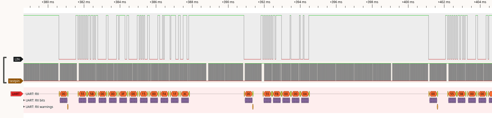
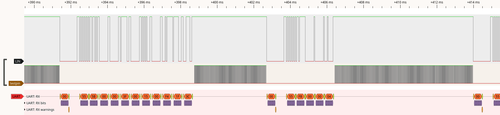

Operation Modes
====================

The below traces show the LIN pin for a master request (2 data bytes) and slave respone (8 data bytes), and a test pin which is toggled in *loop()* to indicate the CPU load. 
The examples were run on on an Arduino Mega 2560 @ 16MHz.

Background Operation
--------------------

====================================

Blocking Operation
------------------

